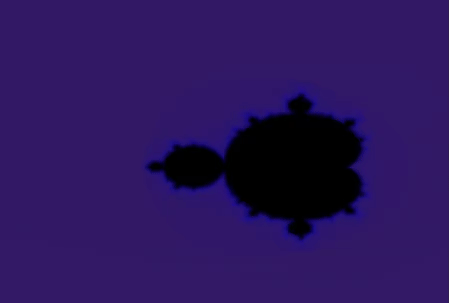

# OpenGL Image load/store demo

This is a simple demo that demonstrates how to use the image load/store
feature of OpenGL 4. The image load/store feature allows you to arbitrarily
write and read from textures in a shader. You can't arbitrarily write to 
a texture without this feature. 

# Demo

Open the file src/main.cpp for the demo source. 
The demo first renders a fractal, and then writes that
fractal to a texture with image store. Then, in a second pass, a box 
filter blur is applied to this same texture, using image load/store.
Finally, we display the texture. 

Note that this demo can also easily be imlemented using Framebuffer Objects. 
But with Framebuffer Objects you cannot write to arbitrary locations in a 
texture, though. 

## Building

The project uses CMake, and all dependencies are included, so you
should use CMake to generate a "Visual Studio Solution"/makefile,
and then use that to compile the program.
